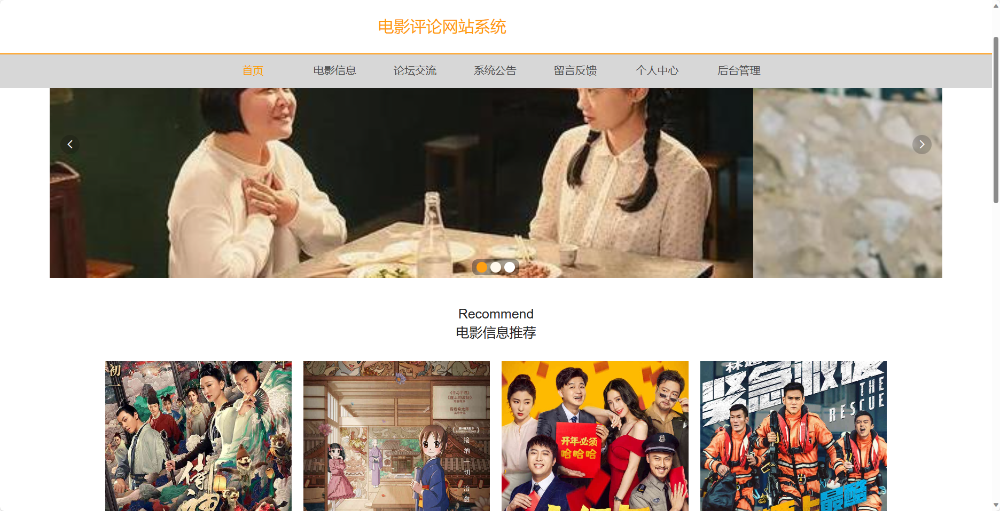
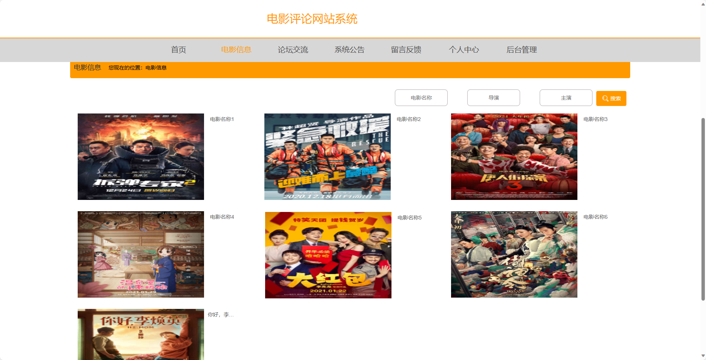
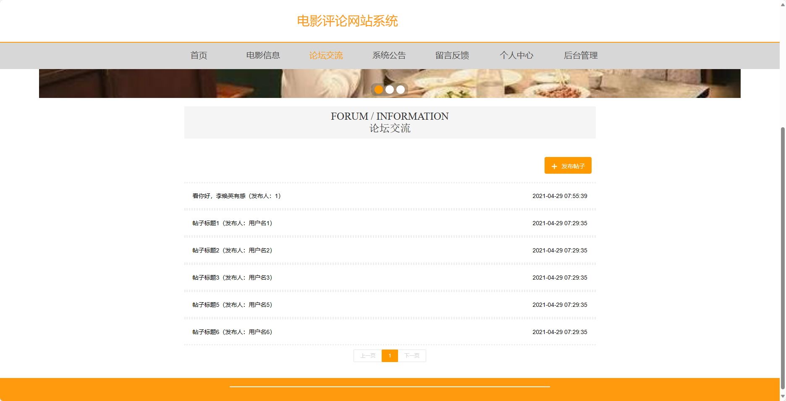
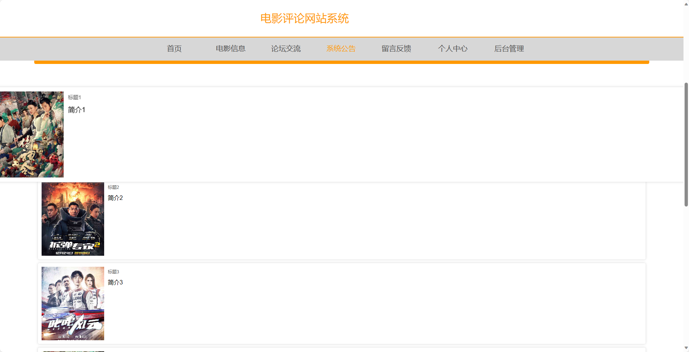
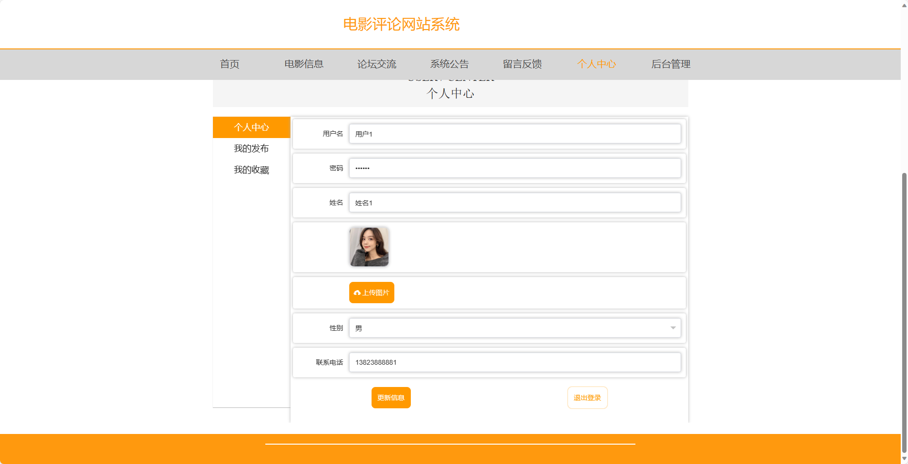
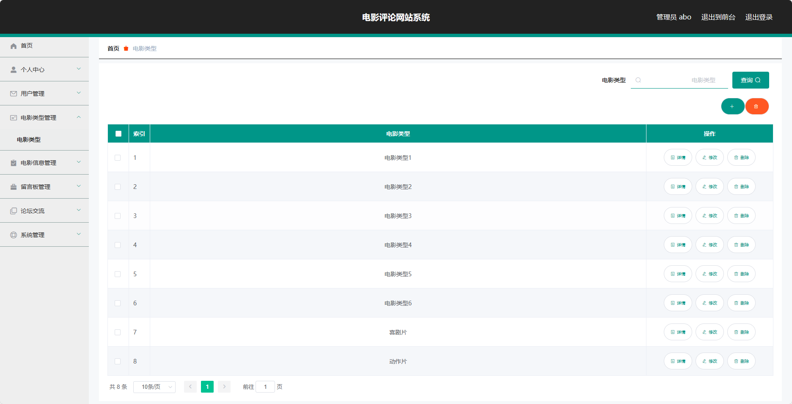

<h1 align="center">基于SpringBoot框架实现的电影评论网站系统【带文档】</h1>

 获取sql文件 QQ: 3645296857 QQ群: 978300347 

<h4> 需要视频演示可联系上述QQ，私发视频链接 </h4>

 获取更多高质量源码，请访问：[mzoo源码网](https://mzoocodes.com/)

## 简介

> 本代码来源于网络,仅供学习参考使用!
>
> <b style="color: dodgerblue"> 提供1.远程部署/2.修改代码/3.定制程序/4.文档指导/5.框架代码讲解、技术解答、代码讲解等服务 </b>
>
> 前台地址：http://localhost:8080/springbootmts92/front/index.html
> 
> 后台地址：http://localhost:8080/springbootmts92/admin/dist/index.html
>
> 管理员: admin 密码: 123456
> 
> 用户：用户1 密码：123456
>

## 项目介绍

基于SpringBoot框架实现的电影评论网站系统【带文档】：前端 vue、axios、elementui，后端 springboot、mybatis，系统角色分为：管理员和用户，管理员在管理后台用户信息、电影信息等；用户可以查看电影信息并进行评价、对系统留言等。主要功能如下：

## 【前台】

- 首页：展示网站的基本信息和推荐电影等内容。
- 电影信息：提供各个电影的详细信息，包括电影简介、演员阵容、上映日期等。
- 论坛交流：提供用户之间的交流平台，可以分享观影心得、讨论电影话题等。
- 系统公告：发布最新的系统公告和电影相关的消息。
- 留言反馈：用户可以留下反馈意见或提出问题。
- 个人中心：用户可以查看和编辑个人信息，包括个人资料、收藏记录等。

## 【后台】
### 管理员

- 个人中心：管理员可以管理自己的个人信息和权限。
- 用户管理：对用户信息进行管理，包括添加、修改和删除用户信息。
- 电影类型管理：管理电影的类型，包括添加、修改和删除电影类型。
- 电影信息管理：管理电影的详细信息，包括添加、修改和删除电影信息。
- 留言板管理：管理用户的留言板，包括审核和删除留言。
- 论坛交流：管理员可以管理论坛交流区，包括审核和删除帖子。
- 系统管理：管理系统的参数设置和日志记录。

### 用户

- 个人中心：用户可以查看和编辑个人信息。
- 我的收藏管理：用户可以查看和管理自己的收藏电影，包括添加、删除收藏。

## 环境

- <b>IntelliJ IDEA 2020.3</b>

- <b>Mysql 5.7.26</b>

- <b>Tomcat 8.0.32</b>

- <b>JDK 1.8</b>

## 运行截图

